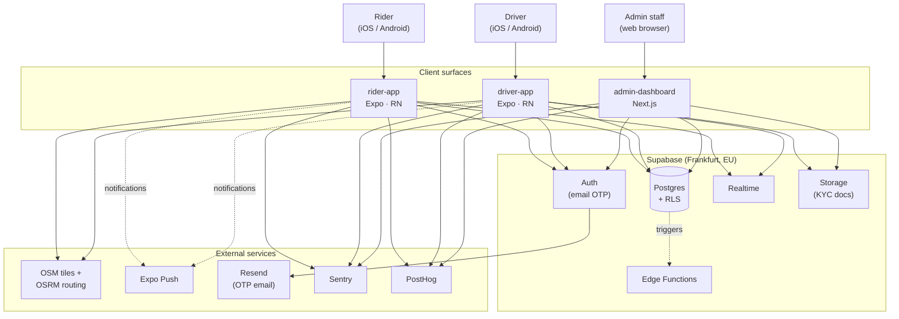
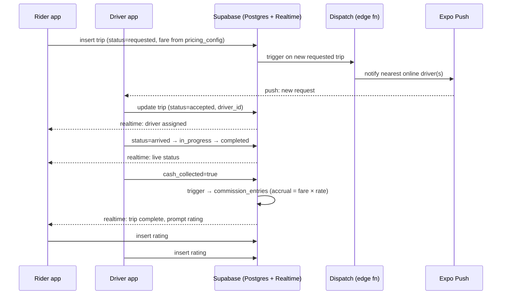
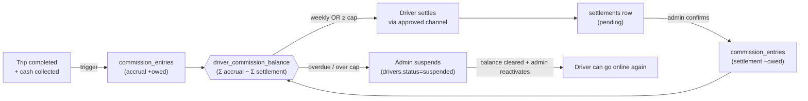

# ARCHITECTURE.md — Jeera (Djera)

System architecture for the Jeera platform: three client surfaces over **one**
Supabase backend. This is the bird's-eye view — how the pieces fit, how data
flows, and where the boundaries are. Detailed plans live in [`docs/`](./docs/):
[build plan](./docs/build-plan.md) · [infrastructure](./docs/infrastructure.md)
· [database & storage](./docs/database-storage.md) · [monitoring](./docs/monitoring.md)
· [error handling](./docs/error-handling.md) · [security](./docs/security.md) ·
[testing & QA](./docs/testing-qa.md). The data contract is
[`supabase/SCHEMA.md`](./supabase/SCHEMA.md).

> **Status: design doc.** The platform is built **mock-first** — every app runs
> end-to-end against in-memory fixtures (`USE_MOCKS=true`) today. The backend
> described here is wired per-feature as each slice flips `USE_MOCKS=false`.

---

## 1. Product in one paragraph

Jeera is a **motorcycle ride-hailing platform for Libya**. A rider requests a
trip; the nearest online driver accepts; the driver navigates to pickup, runs
the trip, and collects **cash** at the end. The platform earns by charging the
driver a **commission** on every completed trip, settled weekly (or at a cap),
with admin-initiated suspension when overdue. Three surfaces: **rider app**,
**driver app**, **admin dashboard**.

---

## 2. System context



**The key architectural fact:** there is **one database** shared by all three
surfaces. Surface-specific behaviour is enforced by **Row-Level Security (RLS)
policies**, not separate schemas or backends. A driver sees only their own rows;
a rider sees only theirs; admins (service role) see all. See
[`supabase/SCHEMA.md`](./supabase/SCHEMA.md) for the RLS matrix.

---

## 3. Container view (what runs where)

| Container | Tech | Hosting | Talks to |
|---|---|---|---|
| `rider-app` | Expo SDK 56 · RN 0.85 · React 19 · Expo Router v5 | EAS Build → App Store / Play | Supabase, OSM/OSRM, Expo Push |
| `driver-app` | Expo SDK 56 · RN 0.85 · React 19 · Expo Router v5 | EAS Build → App Store / Play | Supabase, OSM/OSRM, Expo Push |
| `admin-dashboard` | **Next.js (App Router)** | Vercel | Supabase (elevated policies) |
| Supabase | Managed Postgres + Auth + Realtime + Storage + Edge Functions | Supabase Cloud (EU-Central / Frankfurt) | Resend (email), DB triggers |
| Dispatch / matching | Edge Function (or Postgres `SECURITY DEFINER`) | Supabase | Postgres, Realtime, Expo Push |

> The admin framework is **Next.js on Vercel** per the locked stack
> (`driver-app/TRACKING.md`, 2026-05-29). The `admin-dashboard/CLAUDE.md` still
> reads "TBD" — that doc lags the decision and should be updated when admin
> scaffolding starts.

Shared frontend stack across all surfaces: **Tailwind** (NativeWind on mobile),
**Zustand** (client state), **TanStack Query** (server state), **react-i18next**
(EN default + AR, RTL-safe), **Sentry** + **PostHog**.

---

## 4. The core data flow — a ride lifecycle



Two invariants this flow protects:
- **Fare is priced at request time** from the active `pricing_config` row and
  snapshotted on the trip (`pricing_config_id`) — later config changes never
  rewrite history.
- **Commission is an append-only ledger** (`commission_entries`), never a
  mutable balance column. Outstanding balance = `Σ accruals − Σ settlements`.

---

## 5. The commission / settlement flow



This is the **platform's revenue mechanism**, not a wallet feature. The
admin-tunable knobs (commission rate, settlement cap, approved channels,
auto-decline timer) live as **data** in `pricing_config` rows — so they change
without a migration. See [database & storage](./docs/database-storage.md).

---

## 6. Repository topology

```
jeera/                         ← monorepo root (one git repo)
├── README.md · CLAUDE.md · DEVELOPMENT_PLAYBOOK.md · INSTRUCTIONS.MD · ROADMAP.md
├── ARCHITECTURE.md            ← this file
├── docs/                      ← cross-cutting planning + ops docs (this set)
├── supabase/                  ← THE database (root-owned, shared by all surfaces)
│   ├── SCHEMA.md              ← data contract
│   ├── migrations/            ← versioned SQL (added per feature)
│   ├── seed.sql · config.toml
├── rider-app/                 ← Expo RN  (+ rider-prototype/)
├── driver-app/                ← Expo RN  (+ driver-prototype/)
└── admin-dashboard/           ← Next.js  (+ admin-prototype/)
```

Each app holds only a Supabase **client** + **generated types**
(`database.types.ts`, generated from the one schema) under
`<app>/src/shared/supabase/`. Apps never define their own tables.

---

## 7. Cross-cutting principles

| Principle | Where enforced |
|---|---|
| **Mock-first** — UI ships ahead of backend, every API call has a `USE_MOCKS` branch | `<feature>/data.ts` in every app |
| **One DB, RLS for tenancy** — no per-surface backends | `supabase/` + RLS policies |
| **RTL-safe from day one** — EN default, AR toggle | `ms-/me-/start-/end-` classes, `I18nManager` |
| **Theme system from day one** — light/dark tokens | NativeWind tokens + Tailwind config |
| **Append-only money** — fares/commission never mutated in place | ledger tables + triggers |
| **Cash only** — no in-app rider→driver payment rails | product invariant |
| **EU data residency** — Frankfurt region | Supabase project region |

---

## 8. What is NOT in this architecture (yet)

- Real-time **dispatch/matching engine** — currently a mock; lands as a Supabase
  Edge Function + Realtime when D2 flips live.
- **Turn-by-turn navigation** — prototype uses static OSRM routes; live nav is a
  cross-cutting later item.
- **Payment rails** — out of scope by design (100% cash).
- **SMS OTP** — deferred; email OTP is the launch auth channel.
- **PostGIS / geo-radius dispatch** — `lat`/`lng` numerics for now; PostGIS is an
  optional later optimization.

See [`ROADMAP.md`](./ROADMAP.md) → "Cross-cutting (later)" and the
[build plan](./docs/build-plan.md) for sequencing.
