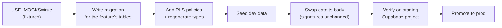

# build-plan.md — phased execution plan

The **execution detail** behind [`../ROADMAP.md`](../ROADMAP.md). ROADMAP says
*what* ships in *what order*; this says, per phase: the **deliverables**, the
**exit criteria**, the **dependencies**, and the **infra cutover** that phase
requires. Mock-first throughout — a feature ships against fixtures first, then
flips `USE_MOCKS=false` against Supabase per [database-storage.md](./database-storage.md).

Status legend: ✅ done · 🟡 in progress · ⏳ planned · 🔌 blocked on backend/client

---

## Timeline (client deck — 11 weeks total)

| Macro-phase | Duration | Maps to |
|---|---|---|
| Documentation | 1 week | Phase 0 below |
| Design | 2 weeks | Phase 1 + prototypes |
| Development | 8 weeks | Phases 2–N (per-surface D/R/A phases) |

The per-surface feature phases (D1–D4 driver, R1–R5 rider, A1–A4 admin) run
**inside** the 8-week development window, parallelized across surfaces.

---

## Phase 0 — Documentation skeleton ✅

**Goal:** every agent can navigate the repo without re-learning it each session.

**Deliverables:** monorepo (6 workspaces) · root docs (README, CLAUDE.md,
playbook, INSTRUCTIONS, ROADMAP) · workspace `CLAUDE.md` stubs · prototype
READMEs · **this planning doc set** + `ARCHITECTURE.md` + `supabase/SCHEMA.md`.

**Exit criteria:** ✅ all of the above committed and cross-linked.

---

## Phase 1 — Foundation (per workspace)

**Goal:** the boot-to-blank-screen scaffold each app builds on (playbook §0–§6).

**Deliverables per app:** Expo/Next scaffold · theme system (light/dark tokens)
· i18n + RTL (EN default, AR toggle) · shared Zustand stores · atomic shared
components · brand assets · boot/auth gate.

| Workspace | Status |
|---|---|
| Driver app foundation | ✅ |
| Rider app foundation | ⏳ |
| Admin dashboard foundation | ⏳ (blocked on framework scaffold — Next.js locked) |

**Exit criteria:** app boots, theme + language toggles work, RTL verified, an
empty authed screen renders behind the auth gate.

**Open decisions:** brand palette (design call) — Djera palm-green/saffron
tokens already in place as the working default.

---

## Phase 1.5 — HTML prototypes

Built **before** each RN/web feature so every feature's `CLAUDE.md` has a
concrete visual reference.

| Surface | Status |
|---|---|
| Driver prototype | ✅ feature-complete (D1–D4) |
| Rider prototype | ⏳ |
| Admin prototype | ⏳ |

**Exit criteria:** every screen a phase will build exists as a clickable mockup.

---

## Driver app — D1 → D4

### D1 — Onboard ✅
- **Features:** `welcome`, `enrollment` (KYC: name, ID, license, plate, doc
  uploads), `auth` (email OTP sign-in → success).
- **Backend touch:** `drivers`, `driver_applications`, `documents` tables;
  Supabase Auth (email OTP); Storage bucket `driver-docs`.
- **Exit criteria:** ✅ new driver registers → pending state; returning driver
  signs in via OTP. (Live admin approval is A2; doc upload is mocked.)

### D2 — Core loop 🟡
- **Features:** `dashboard` (online/offline + map + today summary) ✅,
  `ride-requests` (incoming modal, accept/decline + countdown) 🟡,
  `active-trip` (to-pickup → start → to-dropoff → complete → confirm cash) ⏳.
- **Backend touch:** `trips` (lifecycle), `pricing_config` (fare at request
  time), Realtime (request push + live status), dispatch edge function.
- **Exit criteria:** driver goes online → receives mock request → accepts →
  completes mock trip → **fare + commission recorded**.

### D3 — Money ⏳
- **Features:** `earnings` (daily/weekly/monthly), **`trip-history`** (list +
  detail), **`commission`** (per-trip accrual, weekly settlement UI, suspension).
- **Backend touch:** `commission_entries` (ledger), `settlements`,
  `suspensions`, views `driver_commission_balance` + `driver_today_summary`.
- **Exit criteria:** completed trips appear in history with fare/commission
  breakdown; outstanding commission balance is visible and settleable;
  overdue → suspended state blocks going online.
- **Client-blocked knobs:** commission rate default, settlement cap, approved
  channels — modeled as `pricing_config` data, so schema is unblocked.

### D4 — Retention ⏳
- **Features:** `ratings` (rate rider / own rating), `profile`, `settings`,
  `support` (FAQ, contact, SOS).
- **Backend touch:** `ratings`; profile reads `drivers`/`vehicles`.
- **Exit criteria:** post-trip rating flows both ways; settings persist;
  profile shows document/vehicle status.

---

## Rider app — R1 → R5 ⏳

| Phase | Features | Backend touch | Exit criteria |
|---|---|---|---|
| R1 — Onboard | `auth` (email/phone OTP), `profile` | `riders`, Auth | rider signs in |
| R2 — Book | `pickup-destination`, `fare-estimate`, `request` | `trips` (insert), `pricing_config` | sets pickup+dest → sees fare → submits → mock driver assigned |
| R3 — Live trip | `driver-tracking`, `trip-progress` | `trips` + Realtime | watches driver pickup → drop-off live |
| R4 — Complete | `payment-confirm` (cash), `rating` | `trips`, `ratings` | confirms cash, rates driver |
| R5 — Retention | `trip-history`, `settings`, `support` | `trips`, `ratings` | history + prefs persist |

**R2 exit criteria:** rider sets pickup + destination → sees estimated fare →
submits a mock request → mock driver assigned.

---

## Admin dashboard — A1 → A4 ⏳

| Phase | Features | Backend touch | Exit criteria |
|---|---|---|---|
| A1 — Auth | admin login (separate identity) | `admins`, Auth | admin signs in (elevated RLS) |
| A2 — Drivers | list, detail, approve/suspend, doc review | `drivers`, `driver_applications`, `documents` | **approving a pending driver lets them go online in the driver app** |
| A3 — Operations | trip monitoring, revenue, pricing controls, commission settlement | `trips`, `pricing_config`, `commission_entries`, `settlements`, `suspensions` | edit pricing → driver app prices new trips with it; confirm settlement → driver balance drops |
| A4 — Reports | statistical + settlement reports, export | views + aggregates | daily/weekly/monthly export |

**A2 exit criteria:** admin approves a pending driver application → that driver
can sign into the driver app and go online. (This is the first true
cross-surface integration test.)

---

## Cross-cutting workstreams (run alongside features)

Each has its own doc; this is where they slot into the timeline.

| Workstream | When it starts | Doc |
|---|---|---|
| **Database & storage** — schema → migrations per feature, Storage buckets, RLS | First live-data feature (D1 backend cutover) | [database-storage.md](./database-storage.md) |
| **Infrastructure** — Supabase projects (dev/staging/prod), EAS profiles, Vercel, CI | Before first staging build | [infrastructure.md](./infrastructure.md) |
| **Monitoring** — Sentry + PostHog wired day one | Foundation phase (each app) | [monitoring.md](./monitoring.md) |
| **Error handling** — taxonomy, retries, offline | As `data.ts` clients flip live | [error-handling.md](./error-handling.md) |
| **Security** — RLS review, secrets, store-readiness | Before each live cutover + pre-launch | [security.md](./security.md) |
| **Testing & QA** — CI gates day one, E2E before launch | Foundation → hardening | [testing-qa.md](./testing-qa.md) |

---

## Backend cutover — the mock→live ladder

Flipping a surface from mock to live is itself phased, so we never big-bang it:

Function signatures in each `data.ts` stay identical across the swap — only the
body changes (mock branch → Supabase call). See
[database-storage.md → migrations](./database-storage.md#migrations-workflow).

---

## Pre-launch hardening (before any store submission)

- [ ] All RLS policies reviewed against the [SCHEMA.md matrix](../supabase/SCHEMA.md#rls-sketch)
- [ ] Sentry release health green on staging for ≥1 week ([monitoring.md](./monitoring.md))
- [ ] Error/offline paths exercised ([error-handling.md](./error-handling.md))
- [ ] E2E golden paths pass on the device matrix ([testing-qa.md](./testing-qa.md))
- [ ] Secrets rotated out of dev; prod env vars set in EAS/Vercel
- [ ] EU data-residency + privacy review ([security.md](./security.md))
- [ ] Client-blocked knobs (commission rate, cap, channels, auto-decline timer)
      confirmed and seeded into `pricing_config`
