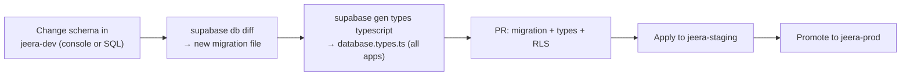

# database-storage.md — data plane

How Jeera stores, secures, migrates, and backs up data. This is the **operations**
companion to [`../supabase/SCHEMA.md`](../supabase/SCHEMA.md) (the *contract* —
tables, columns, enums, RLS matrix). Read the schema for *what the data is*;
read this for *how we run it*.

Platform: **one** Supabase Postgres database (Frankfurt / EU), shared by all
three surfaces. Apps get a **client + generated types** only — never their own
tables. See [ARCHITECTURE §6](../ARCHITECTURE.md#6-repository-topology).

---

## 1. One database, root-owned

```
jeera/
└── supabase/                ← THE database (root-owned, shared)
    ├── SCHEMA.md            ← the contract
    ├── migrations/          ← versioned SQL (timestamped, forward-only)
    ├── functions/           ← edge functions (dispatch, settlement hooks)
    ├── seed.sql             ← dev/mock seed data
    └── config.toml          ← Supabase CLI project config
```

Surface-specific behaviour is **RLS policies**, not separate schemas. Per-app
schemas would drift; a single contract can't.

---

## 2. Conventions (enforced)

From [SCHEMA.md → Conventions](../supabase/SCHEMA.md#conventions):

- **Keys:** `uuid` PKs (`default gen_random_uuid()`), except identity tables
  that key off `auth.users.id` (`drivers`, `riders`, `admins`).
- **Identity:** Supabase Auth owns `auth.users` (email OTP). Each role has a
  profile row keyed by `auth.users.id`.
- **Timestamps:** every table has `created_at timestamptz default now()`;
  mutable tables add a trigger-maintained `updated_at`.
- **Money:** `numeric(12,2)`, currency **LYD** only — never float, no per-row
  currency column.
- **Geo:** `lat/lng numeric(9,6)` (PostGIS deferred until radius dispatch needs it).
- **Enums:** Postgres `enum` types (see [SCHEMA.md → Enum types](../supabase/SCHEMA.md#enum-types)).
- **Soft state, not hard config:** admin-tunable values (commission rate, cap,
  pricing, auto-decline timer) are `pricing_config` **rows**, so the admin
  dashboard changes them with no migration.
- **Append-only money:** `commission_entries` is a ledger; balance is a **view**
  (`Σ accrual − Σ settlement`), never a mutable column.

---

## 3. Storage (KYC documents)

Driver KYC files (ID photo, license, vehicle reg) live in a **private** Supabase
Storage bucket; the DB holds only the path + verification state
(`documents.storage_path`, `documents.status`).

| Bucket | Visibility | Path convention | Who can read |
|---|---|---|---|
| `driver-docs` | **private** | `driver-docs/{driver_id}/{type}-{uuid}.jpg` | the owning driver + admins (Storage RLS) |

Rules:
- Never a public bucket for PII. Access via **signed URLs** with short TTL, or
  through an authed server context (admin review).
- Upload path is owner-scoped; Storage RLS mirrors the table RLS (driver sees
  own, admin sees all).
- File validation (type, size, dimensions) happens client-side first, then is
  re-checked server-side before marking `verified`.

---

## 4. RLS strategy

RLS is **on for every table**. It is the tenancy boundary — not API gateways,
not key secrecy. The matrix lives in
[SCHEMA.md → RLS sketch](../supabase/SCHEMA.md#rls-sketch). Principles:

- **Drivers / riders** read & write only rows where the owning id =
  `auth.uid()`.
- **Status transitions** (`drivers.status`, `driver_applications.status`,
  `settlements.status`) are **admin-only**, enforced via RLS **plus** a
  `SECURITY DEFINER` function — clients never `UPDATE` these columns directly.
- **Admins** are identified by membership in `admins` (or service role in
  trusted server contexts). The admin dashboard's browser bundle uses the
  authed admin session; service-role access is server-only.
- **Realtime** respects RLS: a driver subscribed to new `requested` trips only
  receives rows the dispatch logic exposes to them.

Every new table ships with its policies **in the same migration** — never "add
RLS later."

---

## 5. Migrations workflow

Migrations are the **source of truth**. No console-clicking schema changes in
staging/prod.



Workflow:
1. Iterate freely in **dev**. When stable, capture it: `supabase db diff -f <name>`.
2. Migration files are **timestamped + forward-only**. Destructive changes
   (drop/rename) need an explicit reversal migration.
3. Regenerate types: `supabase gen types typescript --linked > <app>/src/shared/supabase/database.types.ts`
   — all three apps import the **same** generated file.
4. CI runs a **migration check** when `supabase/` changes
   ([infrastructure §6](./infrastructure.md#6-cicd--github-actions)).
5. Promote **dev → staging → prod** — never skip staging.

**Additive-first:** prefer adding columns/tables over dropping, so a
mid-rollout old app build stays compatible with the newer DB.

### Per-feature cutover

Migrations are written **per feature** as it flips `USE_MOCKS=false`, starting
with the built D1 slices (`drivers`, `driver_applications`, `documents`). The
function signatures in each `data.ts` stay identical — only the body swaps from
the mock branch to a Supabase call. See
[build-plan → mock→live ladder](./build-plan.md#backend-cutover--the-mocklive-ladder).

---

## 6. Derived views

Computed, never stored — so they can't drift:

- `driver_commission_balance(driver_id, outstanding)` — `Σ accrual − Σ settlement`.
- `driver_today_summary(driver_id, earnings, trips, cash, hours)` — powers the
  dashboard "today" card and earnings/trip-history stats strip.

---

## 7. Seeding

`supabase/seed.sql` mirrors the mock fixtures so a fresh dev/staging DB behaves
like the mock app: a few drivers (pending/approved/suspended), a `pricing_config`
row (with **placeholder** commission rate/cap pending client confirmation),
sample trips spanning today/yesterday, and a commission ledger with an
outstanding balance. Realistic names, LYD amounts, recent dates.

---

## 8. Backups & recovery

| Environment | Backup posture |
|---|---|
| dev | none needed (reproducible from migrations + seed) |
| staging | Supabase daily backups (free/Pro) |
| **production** | **Supabase Pro — Point-in-Time Recovery (PITR)** before launch |

- Free tier lacks PITR and **auto-pauses** on inactivity → **prod must be Pro**
  before real users ([infrastructure §9](./infrastructure.md#9-cost-posture-early-stage)).
- Recovery drill: restore staging from a backup at least once before launch so
  the runbook is proven, not theoretical.
- The append-only ledger (`commission_entries`) means financial history is
  reconstructable even from a point-in-time restore — no in-place balance to lose.

---

## 9. Data lifecycle & privacy

- **PII:** national ID, license, phone, KYC photos. National ID is **masked in
  UI** (first 4 shown); raw value stays server-side under RLS.
- **Retention:** define a retention window for rejected applications + their
  Storage objects (client/legal decision — see Open questions).
- **Residency:** EU (Frankfurt). Don't introduce a non-EU sub-processor without
  review ([security.md](./security.md)).
- **Deletion:** account deletion must cascade profile + documents + Storage
  objects; ledger/financial rows may need legal retention (anonymize rather than
  hard-delete).

---

## 10. Mapping from current mock types

| App mock | Table(s) |
|---|---|
| `driver-app/src/features/auth/store.ts` `Session` | `auth.users` + `drivers` |
| `driver-app/src/features/enrollment/store.ts` `Application` | `driver_applications` + `documents` + `vehicles` |
| `driver-app/src/features/dashboard` today summary | `driver_today_summary` view |
| trip-history / earnings (D3) | `trips` + `driver_today_summary` |
| commission (D3) | `commission_entries` + `settlements` + `pricing_config` |

Full mapping: [SCHEMA.md → Mapping from current mock types](../supabase/SCHEMA.md#mapping-from-current-mock-types).

---

## Open questions (client-blocked — values, not schema)

These block **real data**, not the schema shape (the knobs are `pricing_config`
rows):

- `commission_rate` default, `settlement_cap`, approved `settlement_channel`
  members, `auto_decline_seconds`.
- `documents.expires_at` re-upload UX (license expiry).
- Rejected-application + KYC-photo **retention window**.
