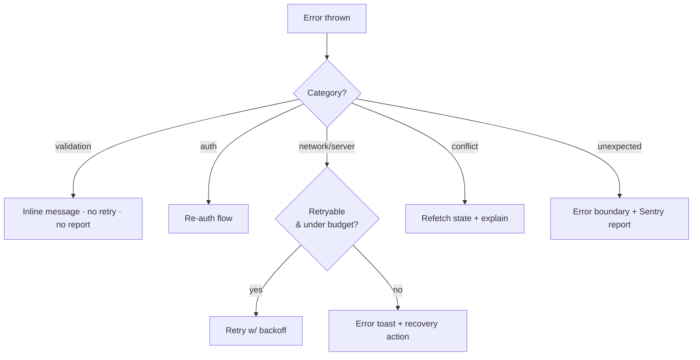

# error-handling.md — failure handling

How Jeera behaves when things go wrong: a shared taxonomy, client + server
patterns, retries, offline behaviour, and what the user sees. The goal is
**predictable failure** — every error has a category, a recovery path, and a
clear user message. Pairs with [monitoring.md](./monitoring.md) (how we *see*
errors) and the playbook's feedback system (§14).

Principle (playbook §22): **validate at boundaries only** — user input and
external APIs. Don't add error handling for impossible internal states; trust
internal code.

---

## 1. Error taxonomy

Every failure maps to one category. Category decides retry + UX.

| Category | Example | Retry? | User sees |
|---|---|---|---|
| **Validation** | bad phone, empty field, wrong OTP | no | inline field error, no toast |
| **Auth** | expired/invalid session, OTP expired | re-auth | route to sign-in / "code expired, resend" |
| **Authorization (RLS)** | action not permitted for this role/owner | no | "You don't have access" (shouldn't happen if UI is correct → log it) |
| **Network** | offline, timeout, DNS | yes (backoff) | toast + retry; offline banner |
| **Server (5xx / RPC)** | Supabase/edge function error | yes (bounded) | toast + retry, recovery action |
| **Conflict / state** | trip already taken, already settled | no | refresh state, explain ("Request no longer available") |
| **Not found** | deep link to a gone resource | no | empty state, back |
| **Unexpected** | unhandled exception | no | error boundary fallback; report to Sentry |



---

## 2. Where errors are caught

The `USE_MOCKS` data layer is the single choke point — every network error is
born in one place per feature.

```ts
// src/features/<feature>/data.ts — the boundary
export async function getTrips(): Promise<Trip[]> {
  if (USE_MOCKS) { await wait(300); return MOCK_TRIPS; }
  const { data, error } = await supabase.from('trips').select('*').order('ended_at', { ascending: false });
  if (error) throw toAppError(error);   // normalize Supabase error → AppError(category)
  return data.map(fromRow);
}
```

`toAppError` maps Supabase/PostgREST error codes → an `AppError` with a
`category` (table above). Everything upstream (hooks, screens) reasons about
**category**, never raw driver errors.

---

## 3. Client patterns (React Native + Next.js)

**TanStack Query** owns server-state errors:
- `retry`: 2–3 for network/5xx with exponential backoff; **0** for
  validation/auth/conflict (don't hammer a deterministic failure).
- `onError` surfaces a toast for mutations; queries render an inline error +
  retry affordance.
- `invalidateQueries` after a conflict so the UI re-syncs to truth.

**Feedback tiers** (playbook §14):
1. **Inline** — validation errors, next to the field.
2. **Toast** — mutation success/failure; auto-dismiss. Always pair an error
   toast with a recovery action (Retry / Go back).
3. **Error boundary** — a screen-level fallback for unexpected exceptions, with
   a "Try again" that resets the boundary. Reports to Sentry.

**Don't double up:** inline + toast for the same error is noise — pick one.

---

## 4. Retry & backoff

| Failure | Policy |
|---|---|
| Network/timeout | exp. backoff (e.g. 0.5s → 1s → 2s), cap 3 tries, then surface |
| 5xx / edge fn | bounded retry (2), then surface + report |
| OTP send | user-initiated resend with a cooldown (no silent retry) |
| Realtime drop | auto-reconnect (Supabase client) + refetch on reconnect |
| Idempotency | retried **mutations** must be safe — e.g. "confirm cash" / "accept trip" guarded server-side so a double-fire can't double-charge or double-assign |

Idempotency matters most for **money + state transitions**: accepting a trip,
confirming cash, confirming a settlement. These go through `SECURITY DEFINER`
functions that are safe to call twice (check current state, no-op if already
applied) — see [database-storage §4](./database-storage.md#4-rls-strategy).

---

## 5. Offline & connectivity

Drivers operate on motorbikes with patchy coverage — offline is a **first-class
state**, not an error.

| Situation | Behaviour |
|---|---|
| App offline (idle) | offline banner; reads serve last cached query data |
| Goes offline **mid-trip** | active-trip state is **locally durable** (persisted store) so the screen survives; queue the terminal action (arrived / complete / cash-confirmed) and flush on reconnect |
| OTP / sign-in offline | block with a clear "no connection" message; no partial auth |
| Reconnect | refetch active queries; flush queued mutations idempotently |

> **Open product question** (carried from REQUIREMENTS §5): exact offline-mid-trip
> behaviour isn't fully specified by the client. The above is the engineering
> default — confirm before D2 `active-trip` flips live.

Key rule: never **lose** a completed trip or a cash collection because the
network blipped. Persist locally, reconcile on reconnect.

---

## 6. What never reaches a log

Scrub before anything goes to Sentry/PostHog/console
([monitoring §2](./monitoring.md#2-sentry--errors--release-health)):

- OTP codes, auth tokens, refresh tokens, service-role keys
- National ID, license number, phone (or mask)
- KYC Storage URLs / signed URLs
- Full request/response bodies containing the above

Use Sentry `beforeSend` + a small allowlist of safe context (route, feature,
category, anonymized ids).

---

## 7. Server-side (Supabase / edge functions)

- **RLS denials** are a *backstop*, not the primary UX. If a user hits one, the
  client UI let them try something they shouldn't have — log it as a bug signal.
- **Edge functions** return typed error shapes (`{ code, message }`) that map to
  the client taxonomy; unexpected ones report to Sentry (server SDK).
- **Constraints** (FK, check, unique) are real validation — surface the
  friendly message, don't leak the Postgres error text.
- **Dispatch** failures (no driver found, all declined) are a *state*, not a
  crash: the rider sees "still searching" / "no drivers nearby," not an error.

---

## 8. User-facing copy

- Every error message is a **`t()` key with EN + AR** — no raw strings, no leaked
  technical text (playbook / INSTRUCTIONS §3).
- Tone: what happened + what to do. "Couldn't load your trips. Check your
  connection and retry." — not "Error 500."
- RTL-safe, and amounts/ids stay LTR even inside an Arabic error string.

---

## Checklist (per feature going live)

- [ ] `data.ts` normalizes errors via `toAppError` (category, not raw)
- [ ] Query/mutation retry policy set per category
- [ ] Mutations that touch money/state are idempotent server-side
- [ ] Offline path defined (esp. active-trip)
- [ ] Error + empty + loading states designed, in EN + AR
- [ ] PII scrubbed from all reports
- [ ] Unexpected errors caught by a boundary and reported
