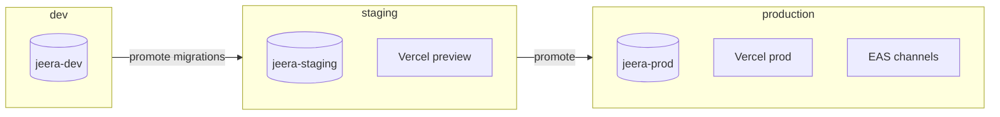
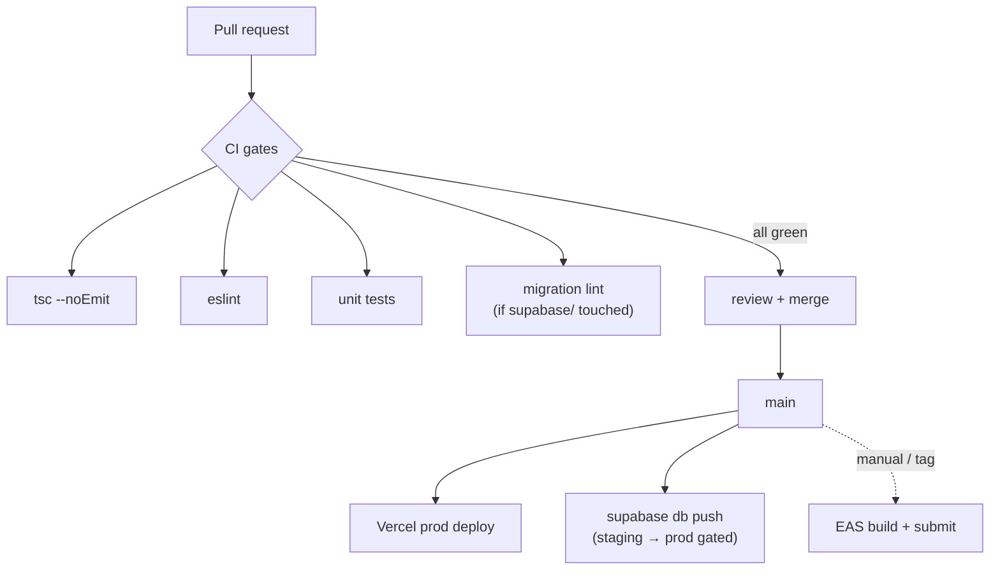

# infrastructure.md — hosting & deployment

How Jeera is hosted, built, and shipped across its three surfaces and one
backend. Mock-first means there's nothing to deploy server-side until the first
live cutover — but the pipeline below is the target.

Locked stack: **Supabase** (Frankfurt) · **EAS Build + EAS Update** (mobile) ·
**Vercel** (admin) · **GitHub Actions** (CI). See [README](./README.md#locked-stack-reference).

---

## 1. Environments

Three environments, three Supabase projects, three config sets. Never share a
database between environments.

| Environment | Supabase project | Mobile (`USE_MOCKS`) | Admin | Audience |
|---|---|---|---|---|
| **dev** | `jeera-dev` (EU) | `true` (fixtures) | local / preview | engineers |
| **staging** | `jeera-staging` (EU) | `false` → staging DB | Vercel preview | internal QA + client demo |
| **production** | `jeera-prod` (EU) | `false` → prod DB | Vercel production | real users |

**Region:** all three in EU-Central (Frankfurt) for data residency. Start on
Supabase **free tier** (dev/staging); upgrade prod to Pro before launch (PITR
backups, no auto-pause — see [database-storage.md](./database-storage.md#backups--recovery)).



---

## 2. Configuration & secrets

| What | Mobile | Admin (Next.js) |
|---|---|---|
| Supabase URL + **anon** key | `app.config.js` → `extra` via `EXPO_PUBLIC_*` | `NEXT_PUBLIC_SUPABASE_*` |
| Supabase **service-role** key | ❌ never in a client | server-only env (Vercel encrypted) |
| `USE_MOCKS` | `EXPO_PUBLIC_USE_MOCKS` | `NEXT_PUBLIC_USE_MOCKS` |
| Sentry DSN | `EXPO_PUBLIC_SENTRY_DSN` | `NEXT_PUBLIC_SENTRY_DSN` |
| PostHog key | `EXPO_PUBLIC_POSTHOG_KEY` | `NEXT_PUBLIC_POSTHOG_KEY` |

**Rules** (also in [security.md](./security.md#secrets)):
- The **anon key is public** by design — RLS is what protects data, not key
  secrecy. The **service-role key bypasses RLS** and lives only in trusted
  server contexts (admin server actions, edge functions, CI).
- `.env` is gitignored; commit only `.env.example`. Mobile secrets per env live
  in **EAS** (`eas.json` env / EAS secrets); admin secrets in **Vercel**
  project env vars.
- Anything reaching a client must be prefixed `EXPO_PUBLIC_` / `NEXT_PUBLIC_`
  and must be safe to expose.

---

## 3. Mobile — EAS Build & Update

### Build profiles (`eas.json` per app)

| Profile | Distribution | `USE_MOCKS` | Channel | Use |
|---|---|---|---|---|
| `development` | internal (dev client) | `true` | — | local native dev |
| `preview` | internal | `true` | `preview` | share mock build with team/client |
| `staging` | internal (TestFlight / Play internal) | `false` | `staging` | QA against staging DB |
| `production` | store | `false` | `production` | App Store / Play |

```jsonc
// eas.json (shape)
{
  "build": {
    "preview":    { "distribution": "internal", "channel": "preview",
                    "env": { "EXPO_PUBLIC_USE_MOCKS": "true" } },
    "staging":    { "distribution": "internal", "channel": "staging",
                    "env": { "EXPO_PUBLIC_USE_MOCKS": "false" } },
    "production": { "distribution": "store", "channel": "production",
                    "env": { "EXPO_PUBLIC_USE_MOCKS": "false" } }
  }
}
```

### OTA updates (EAS Update)

`runtimeVersion: { policy: 'sdkVersion' }`. JS-only changes ship over-the-air to
the matching channel without a store review:

```bash
eas update --branch staging --message "trip-history: fix RTL date order"
```

**Native changes** (new native module, SDK bump, permissions) require a **new
build** — OTA can't deliver them. Version bumps touch **two files**:
`app.config.js` `version` *and* `src/shared/constants/version.ts` (playbook §18).

### Store delivery

- iOS: EAS Build → TestFlight (internal) → App Store. Device registration via
  `eas device:create` for ad-hoc internal builds; past ~5 testers, use TestFlight.
- Android: EAS Build → Play Console internal track → production.

---

## 4. Admin dashboard — Vercel

- **Framework:** Next.js (App Router) → Vercel.
- **Branch → preview:** every PR gets a Vercel preview URL wired to
  `jeera-staging`.
- **`main` → production:** Vercel production deploy on merge, wired to
  `jeera-prod`.
- Server-only Supabase access (service role) runs in **server actions / route
  handlers**, never shipped to the browser. The browser bundle uses the anon
  key + the admin's authed session (RLS scoped to `admins` membership).

---

## 5. Backend — Supabase

- **Migrations** are the source of truth (`supabase/migrations/`), applied via
  the Supabase CLI / GitHub Action. No console-clicking schema changes in
  staging/prod — dev only, then `db diff` into a migration.
- **Edge Functions** (dispatch/matching, settlement confirmation hooks) deploy
  via `supabase functions deploy` from CI.
- **Storage** buckets (`driver-docs`, private) created via migration/config so
  they're reproducible across projects.

Full workflow: [database-storage.md](./database-storage.md).

---

## 6. CI/CD — GitHub Actions



**PR gates** (per [testing-qa.md](./testing-qa.md)): type-check, lint, unit
tests, and a migration check when `supabase/` changes. Mobile store builds are
**manual/tagged**, not on every merge (build minutes are finite). OTA updates to
`staging` can be automated on merge to `main`; `production` OTA is gated on a
release tag.

---

## 7. Release process

1. Land features on `main` behind mock or live as appropriate.
2. Cut a release branch/tag → bump both version files.
3. **Admin:** Vercel promotes the build to production automatically on merge.
4. **Backend:** promote migrations dev → staging → prod (never skip staging).
5. **Mobile:** `eas build --profile production` → submit to stores; ship JS
   fixes between store releases via `eas update --branch production`.
6. Watch [Sentry release health](./monitoring.md#release-health) for the first
   24–48h before widening rollout.

---

## 8. Rollback

| Surface | Rollback move |
|---|---|
| Admin (Vercel) | Instant — "Promote" a previous deployment |
| Mobile (OTA) | `eas update --branch <ch>` republishing the prior good bundle; or EAS Update rollback |
| Mobile (native) | Can't un-ship a store binary — fix forward via OTA or expedited review |
| Database | Forward-only migrations; destructive changes need a reversal migration + (prod) PITR restore as last resort — [database-storage.md](./database-storage.md#backups--recovery) |

**Principle:** database changes are **forward-only and additive** wherever
possible (add columns/tables, don't drop). That keeps an old app build
compatible with a newer DB during a staged rollout.

---

## 9. Cost posture (early stage)

Everything starts on free tiers (Supabase free, Vercel hobby/pro, Expo free
push, PostHog free, Sentry dev). Upgrade triggers:
- Supabase free **auto-pauses** after inactivity and lacks PITR → move **prod**
  to Pro before launch.
- Expo Push is free; only move to direct FCM/APNs if scale demands it.
- Watch Supabase egress (map tiles are external/OSM, so DB egress stays low).

---

## Open questions

- Apple Developer + Google Play **org accounts** — who owns them (client vs us)?
- Custom **domain** for the admin dashboard.
- CI runner for **EAS** — EAS cloud build vs self-hosted (cost vs control).
- Production Supabase **Pro upgrade** timing (tie to first real-user launch).
