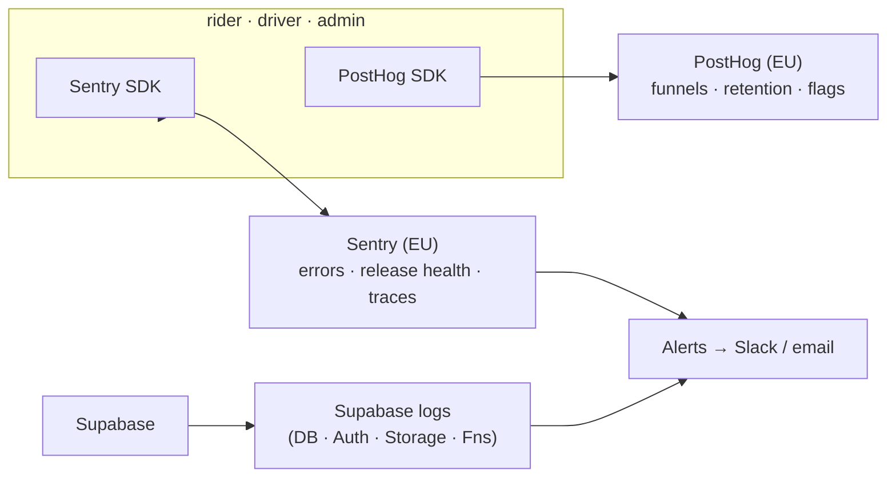

# monitoring.md — observability

How we know Jeera is healthy: errors, product analytics, logs, alerts. Wired
**from day one** in each app's foundation phase — retrofitting observability is
as painful as retrofitting themes.

Locked stack: **Sentry** (errors + release health, RN + web) · **PostHog**
(product analytics, EU). Both have EU hosting to match data residency.

---

## 1. What we watch, and with what

| Signal | Tool | Surfaces |
|---|---|---|
| Crashes, JS errors, native exceptions | **Sentry** | rider, driver, admin |
| Release health (crash-free users/sessions) | **Sentry** | mobile |
| Performance traces (slow screens, slow queries) | **Sentry** | all |
| Product funnels, retention, feature usage | **PostHog** | all |
| Session timeline (what led to a bug) | PostHog + Sentry breadcrumbs | all |
| Backend logs, DB, Auth, Storage, Edge Functions | **Supabase** dashboard/logs | backend |
| Push delivery | Expo Push receipts | mobile |

---

## 2. Sentry — errors & release health

**Setup:**
- DSN via `EXPO_PUBLIC_SENTRY_DSN` / `NEXT_PUBLIC_SENTRY_DSN`
  ([infrastructure §2](./infrastructure.md#2-configuration--secrets)).
- `environment` = dev / staging / production. **Disable in dev** (or route to a
  dev project) so local noise doesn't pollute prod metrics.
- **`release`** = the app version (`src/shared/constants/version.ts` /
  `app.config.js`); upload source maps in the EAS/Vercel build so stack traces
  de-minify.
- Tie each EAS Update / Vercel deploy to a Sentry release so health is per-ship.

**Release health** (mobile): track **crash-free sessions** and **crash-free
users** per release. The pre-launch bar: a release sits on `staging` with green
health for ≥1 week before production widening
([build-plan → hardening](./build-plan.md#pre-launch-hardening-before-any-store-submission)).

**Hygiene:**
- Scrub PII before send (`beforeSend`): no national ID, phone, OTP, tokens, or
  KYC URLs in error payloads ([error-handling §6](./error-handling.md#6-what-never-reaches-a-log)).
- Group expected/handled errors separately from crashes (see taxonomy in
  [error-handling.md](./error-handling.md#1-error-taxonomy)).
- Attach breadcrumbs (route changes, key actions) but never sensitive values.

---

## 3. PostHog — product analytics

EU-hosted (self-hostable). Use it to answer product questions, not to debug
crashes (that's Sentry).

**Event naming:** `surface.feature.action` — e.g. `driver.dashboard.went_online`,
`driver.request.accepted`, `driver.trip.cash_confirmed`,
`rider.book.request_submitted`, `admin.driver.approved`.

**Key funnels to instrument:**

| Surface | Funnel | Why |
|---|---|---|
| Driver | enroll → approved → first online → first trip | onboarding drop-off |
| Driver | request shown → accepted → completed → cash confirmed | core-loop conversion + decline rate |
| Driver | commission accrued → settled | settlement compliance |
| Rider | request → driver assigned → completed → rated | booking conversion |
| Admin | application submitted → reviewed | review SLA |

**Identity:** alias the PostHog distinct id to the auth user id post-login so
funnels stitch across sessions. **Never** send PII as event properties — ids and
enums only.

**Feature flags:** PostHog flags can gate risky cutovers (e.g. flip a feature to
live data for internal users first).

---

## 4. Backend observability (Supabase)

- **Logs:** Postgres, Auth, Storage, Edge Function logs in the Supabase
  dashboard per project.
- **Edge Functions** (dispatch, settlement hooks): structured logs + report
  unexpected errors to Sentry (server SDK) so backend + client errors land in
  one place.
- **DB health:** watch slow queries, connection counts, and (post-launch) table
  growth — especially `trips` and `commission_entries` (append-only, grows
  forever; plan partitioning/archival if volume demands).
- **Auth:** monitor OTP send failures / Resend deliverability (a spike =
  drivers/riders locked out).

---

## 5. SLIs / SLOs (initial targets)

Starting targets — tighten with real traffic.

| SLI | Target |
|---|---|
| Crash-free sessions (mobile) | ≥ 99.5% |
| Crash-free users (mobile) | ≥ 99.0% |
| Trip request → driver notified (dispatch latency) | p95 < 5s |
| OTP email delivery | p95 < 30s, success ≥ 99% |
| API/data call error rate (non-validation) | < 1% |
| Admin dashboard p75 page load | < 2.5s |

These also drive [error-handling.md](./error-handling.md) retry budgets and the
launch gate.

---

## 6. Alerting & on-call

| Trigger | Severity | Route |
|---|---|---|
| Crash-free users drops below SLO on prod | high | Slack + email, page owner |
| Error-rate spike (Sentry threshold) on new release | high | Slack, consider OTA rollback |
| OTP delivery failure spike | high | Slack — users can't log in |
| Dispatch latency p95 over budget | medium | Slack |
| Supabase approaching tier limits (storage, egress, DB size) | medium | Slack |
| New error type first-seen in prod | low | digest |

- Route Sentry alerts to a **Slack channel** + email; PostHog for
  product-metric anomalies (e.g. accept-rate cliff).
- Define a lightweight **on-call** owner per release during the launch window.
- An OTA rollback ([infrastructure §8](./infrastructure.md#8-rollback)) is the
  fastest mitigation for a bad JS-only release.

---

## 7. Dashboards

- **Sentry:** one project per surface; saved views for "prod, this release,
  unresolved."
- **PostHog:** a board per surface with the core funnel + retention + DAU/WAU.
- **Supabase:** project dashboards for DB/Auth/Storage usage.
- A single **launch dashboard** (PostHog) combining crash-free %, core-loop
  conversion, and dispatch latency for the first-week war-room.

---

## Open questions

- Sentry/PostHog **org + EU project** ownership (client vs us).
- Alert **Slack workspace/channel** + on-call rota for launch.
- Log **retention windows** (Supabase tier-dependent).
- Whether to add **uptime monitoring** (e.g. for the admin dashboard + a
  Supabase health ping) — likely yes pre-launch.
