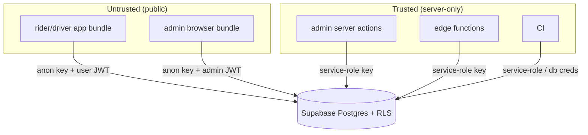

# security.md — security & privacy

Jeera handles **PII** (national ID, license, KYC photos, phone) and **money**
(commission ledger, settlements) for users in **Libya**, with data resident in
the **EU (Frankfurt)**. This doc is the security posture across all surfaces.
Mobile-specific patterns are in the playbook (§10); this is the platform view.

---

## 1. Trust model

**Core stance:** the **anon key is public** and that's fine — **RLS** is the
security boundary. The **service-role key bypasses RLS** and exists **only** in
trusted server contexts (admin server actions, edge functions, CI). It must
never appear in a mobile bundle or a browser bundle.

---

## 2. Authentication

- **Supabase Auth, email OTP** (6-digit / magic link). SMS deferred.
- Each role has a profile row keyed by `auth.users.id` (`drivers`, `riders`,
  `admins`) — identity is never invented client-side.
- **Admin identity is separate** from rider/driver (own login, `admins`
  membership gates elevated RLS).
- **OTP delivery** via Resend (prod) — deliverability is a security *and*
  availability concern (a failed OTP = locked-out user); monitored
  ([monitoring §4](./monitoring.md#4-backend-observability-supabase)).
- **Session hardening (mobile):** tokens in **SecureStore**, never AsyncStorage;
  foreground re-lock watchdog on token expiry; full wipe on sign-out (playbook §9–10).
- **PIN / biometric** session lock is a §5 client-blocked scope item — the
  mobile pattern (SHA-256 PIN via `expo-crypto`, `expo-local-authentication`) is
  ready in the playbook; scope TBD with client.

---

## 3. Authorization (RLS is the boundary)

- RLS **on for every table**; policies ship in the **same migration** as the
  table ([database-storage §4](./database-storage.md#4-rls-strategy)).
- Drivers/riders: own-rows only. Admins: all. Matrix in
  [SCHEMA.md → RLS sketch](../supabase/SCHEMA.md#rls-sketch).
- **State transitions** (approve/suspend, settle, status changes) are admin-only
  via RLS **+** `SECURITY DEFINER` functions — clients can't `UPDATE` those
  columns directly.
- **Storage** RLS mirrors table RLS: `driver-docs` is private, owner + admin
  read only, via signed URLs.
- An RLS denial reaching a normal user = a UI bug (the app offered a disallowed
  action) → treat as a signal, not just a block
  ([error-handling §7](./error-handling.md#7-server-side-supabase--edge-functions)).

---

## 4. Secrets

| Secret | Lives in | Never in |
|---|---|---|
| Supabase **anon** key | client bundles (public by design) | — |
| Supabase **service-role** key | EAS secrets (CI), Vercel server env, edge fn env | any client bundle |
| Sentry/PostHog keys | `*_PUBLIC_*` env (safe to expose) | — |
| Resend / 3rd-party API keys | server-only env | client |
| DB connection string | CI / Supabase only | repo, client |

- `.env` gitignored; commit only `.env.example`. Per-env secrets in **EAS** and
  **Vercel**, not in git ([infrastructure §2](./infrastructure.md#2-configuration--secrets)).
- Anything reaching a client is prefixed `EXPO_PUBLIC_` / `NEXT_PUBLIC_` and must
  be safe to expose. If it isn't safe to expose, it can't have that prefix.
- Rotate any key that ever lands in a commit or a log; scrub git history if so.

---

## 5. Data protection & privacy

- **PII inventory:** national ID, license number, plate, phone, email, KYC
  photos, location traces.
- **Masking:** national ID masked in UI (first 4); raw value server-side under
  RLS only.
- **In transit:** HTTPS only (Supabase enforces TLS). **At rest:** Supabase
  managed encryption.
- **Residency:** EU / Frankfurt; no non-EU sub-processor without review.
- **Minimization:** collect only what KYC + dispatch need; don't log PII
  ([error-handling §6](./error-handling.md#6-what-never-reaches-a-log)).
- **Retention & deletion:** account deletion cascades profile + documents +
  Storage; financial ledger rows may require legal retention → anonymize rather
  than hard-delete (policy TBD — Open questions).
- **Location:** driver live location is operational data; define how long traces
  are kept and who can see them.

---

## 6. Mobile app hardening (summary)

From playbook §10 — the checklist that gates a store build:

- [ ] Tokens/PIN-hash in SecureStore only
- [ ] PIN stored as salted SHA-256, never plaintext
- [ ] Biometric availability checked before offering it
- [ ] Sensitive values masked by default; privacy mode where applicable
- [ ] No secrets in the bundle; HTTPS-only base URLs
- [ ] Deep links validated (no trusting params for authz)
- [ ] Jailbreak/root posture decided (at least: don't store unencrypted secrets)

---

## 7. Supply chain & CI

- Pin toolchain per workspace (Expo SDK, RN, Node) — already convention.
- Dependabot/renovate for dependency updates; review transitive additions.
- CI uses **least-privilege** credentials; service-role/DB creds are GitHub
  encrypted secrets, never echoed in logs.
- Don't add a new third-party SDK without a privacy/footprint review (it may ship
  in a user's bundle and see PII).

---

## 8. Financial integrity

The commission system is real money — protect it structurally:

- **Append-only ledger** (`commission_entries`): no mutable balance to tamper
  with; balance is a derived view.
- **Idempotent** money transitions (accept, cash-confirm, settle) so retries
  can't double-apply ([error-handling §4](./error-handling.md#4-retry--backoff)).
- **Admin-only** settlement confirmation + suspension, audit-trailed
  (`settlements.confirmed_by`, `suspensions.suspended_by`).
- Fare **snapshotted** at request time (`pricing_config_id`) — pricing changes
  can't rewrite past fares.

---

## 9. Compliance & pre-launch review

- [ ] RLS policies reviewed against the full SCHEMA.md matrix
- [ ] Penetration sanity pass on auth + RLS (try to read another driver's rows)
- [ ] Privacy policy + terms (referenced in app legal copy) finalized
- [ ] EU/GDPR-aligned data handling (residency ✓; DPA with Supabase/Resend/
      Sentry/PostHog as needed)
- [ ] Secrets rotated out of dev; prod keys set in EAS/Vercel
- [ ] Store data-safety / privacy-nutrition declarations match reality
- [ ] `security-review` run on the pre-launch branch

---

## Open questions

- **PIN/biometric** session-lock scope (§5 — client decision).
- KYC photo + rejected-application **retention window**.
- Driver **location-trace** retention + visibility.
- Account-deletion vs **financial-record retention** reconciliation (legal).
- Data Processing Agreements with each sub-processor (Supabase, Resend, Sentry,
  PostHog) — confirm EU terms.
