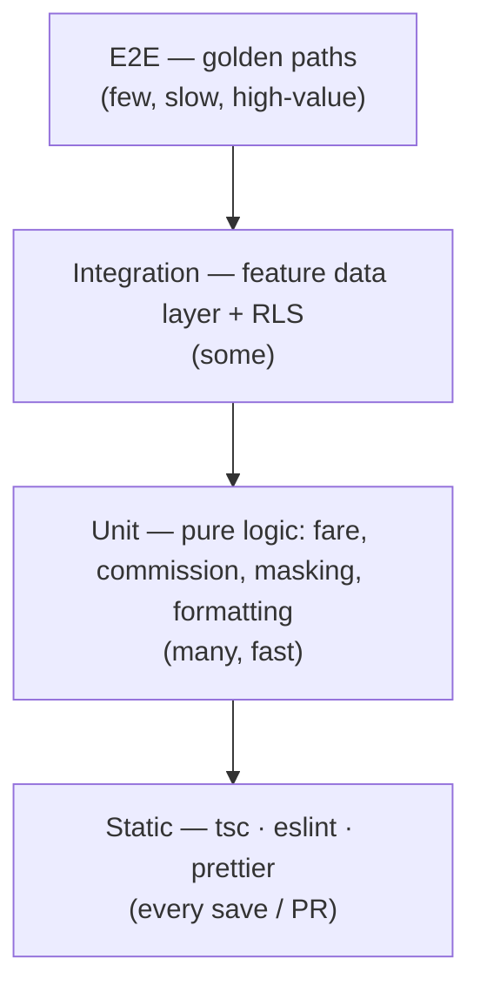

# testing-qa.md — testing & QA

How we keep Jeera correct as it grows. CI gates from day one; manual smoke
across the axes that bite RN apps (RTL, theme, mock/live); E2E on the golden
paths before launch. Complements the playbook's verification workflow (§21).

---

## 1. Test pyramid

Bias **down** the pyramid: most confidence comes from cheap unit tests on the
pure logic (fare math, commission accrual, ID masking, date grouping, phone
validation) and from static checks. E2E covers only the cross-surface golden
paths.

---

## 2. Static checks (every PR — blocking)

| Check | Command | Gate |
|---|---|---|
| Type-check | `npx tsc --noEmit` | PR blocking |
| Lint | `npx eslint .` (mobile: `expo lint`) | PR blocking |
| Format | `prettier --check` (per-workspace config) | PR blocking |
| Migration check | runs when `supabase/` changes | PR blocking |

These are the **CI gates** ([infrastructure §6](./infrastructure.md#6-cicd--github-actions)).
Type-check proves it compiles — **not** that it works (playbook §21).

---

## 3. Unit tests

Target the **pure** logic that's easy to get wrong and expensive to get wrong:

- **Fare:** `opening_fare + per_km_rate × km` against `pricing_config` fixtures.
- **Commission:** `fare × rate`, net-to-driver, ledger balance
  (`Σ accrual − Σ settlement`).
- **Masking/format:** national-ID mask, phone `+218` formatting + validation,
  LYD/amount formatting (LTR even in RTL), date/day grouping.
- **State machines:** trip status transitions, settlement state, suspension
  gating (can/can't go online).

Keep them framework-free where possible (test the lib/helper, not the component).

---

## 4. Integration tests

- **Data layer:** test each feature's `data.ts` against both branches — mock
  (deterministic fixtures) and, where feasible, a **local Supabase** instance
  for the live branch.
- **RLS:** the highest-value backend test — assert a driver **cannot** read
  another driver's trips/commission, a rider can't see driver-only fields, and
  state-transition columns reject direct client updates. Run against a seeded
  local/staging DB ([security §3](./security.md#3-authorization-rls-is-the-boundary)).
- **Auth:** OTP sign-in happy path + expired-code path.

---

## 5. E2E (golden paths, pre-launch)

Tooling candidate: **Maestro** (simple, RN-friendly) or Detox. Cover the phase
**exit criteria** as flows:

| Surface | Golden path |
|---|---|
| Driver | enroll → (admin approve) → go online → receive request → accept → complete → confirm cash → see it in history with commission |
| Driver | commission accrues → settle → balance drops; overdue → suspended → can't go online |
| Rider | set pickup+dest → see fare → request → driver assigned → track → complete → rate |
| Admin | approve pending driver → that driver can go online (**cross-surface**) |
| Admin | change pricing → new trips price with it; confirm settlement → driver balance drops |

The cross-surface ones (admin action → mobile effect) are the most important
integration proof and the hardest to fake — run them against **staging**.

---

## 6. Manual smoke matrix (per feature, before "done")

The axes that silently break RN apps. For **every** UI change, walk the feature
across:

| Axis | Values |
|---|---|
| Language / direction | **English (LTR)** and **Arabic (RTL)** |
| Theme | **light** and **dark** |
| Data source | **mock** (`USE_MOCKS=true`) and **live** branch |
| Device | small + large screen; notch/safe-area |
| States | loading · empty · error · success |

RTL is not optional: chevrons flip, amounts/IDs stay LTR, OTP boxes stay
LTR-ordered, spacing uses logical props (playbook §7). **Launch the simulator
and use the feature** — don't declare done from a green type-check (§21).

---

## 7. Accessibility & i18n QA

- Every visible string via `t()` with **EN + AR** keys present (no missing-key
  fallbacks shipped) — grep for hardcoded strings in review.
- Touch targets ≥ 44px; `accessibilityRole`/`accessibilityLabel` on controls.
- Dynamic type / font scaling doesn't clip critical CTAs.
- Color contrast meets AA in both themes.

---

## 8. Release QA gate (before store submit / prod promote)

- [ ] CI green (type, lint, format, migrations)
- [ ] Unit + integration + RLS tests pass
- [ ] E2E golden paths pass on the device matrix against **staging**
- [ ] Manual smoke matrix walked for changed features (LTR/RTL · light/dark · mock/live)
- [ ] [Sentry release health](./monitoring.md#2-sentry--errors--release-health)
      green on staging ≥ 1 week
- [ ] Error/offline paths exercised ([error-handling.md](./error-handling.md))
- [ ] `security-review` clean ([security §9](./security.md#9-compliance--pre-launch-review))

---

## 9. Device matrix (target)

| Platform | Devices |
|---|---|
| iOS | a small (SE-class) + a notched recent iPhone; min supported iOS per Expo SDK 56 |
| Android | a low-end + a recent device; min API per Expo SDK 56 |
| Admin web | latest Chrome + Safari; desktop-first, tablet-tolerant |

---

## Open questions

- E2E tool decision: **Maestro vs Detox** (lean Maestro for speed of authoring).
- Whether to stand up an **ephemeral Supabase** per PR for live-branch
  integration tests, or test live only against staging.
- Device-farm (e.g. for the launch matrix) vs local devices.
